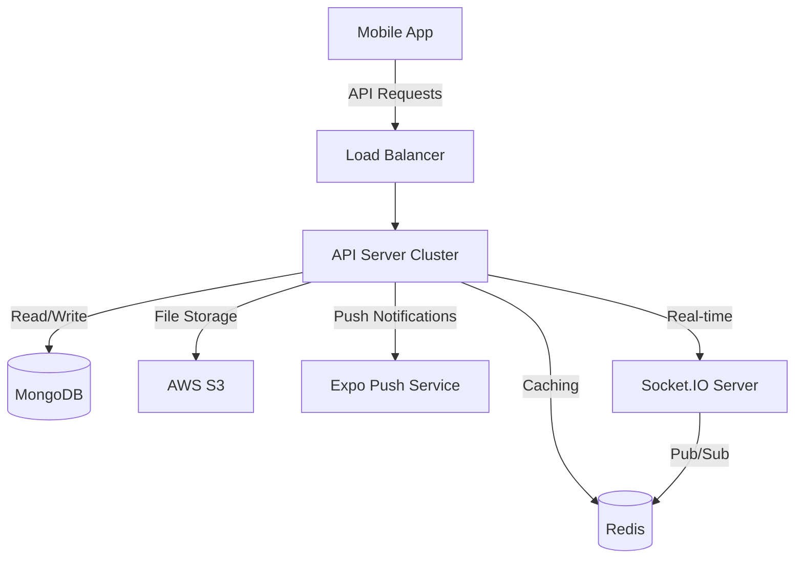
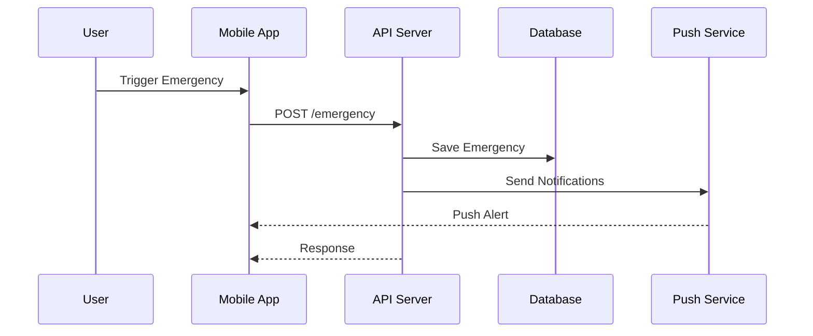

# Nigerian Emergency Response & Community Safety Application

A comprehensive mobile application designed to enhance community safety and emergency response across Nigeria.

## Overview

This cross-platform mobile application serves as a centralized platform for addressing various security concerns in Nigeria, including emergency response coordination, community safety monitoring, and resource sharing. Built with React Native and Expo for the frontend and Node.js with MongoDB for the backend, it provides a robust solution for both iOS and Android devices.

## Key Features

- **Emergency Response System**
  - One-tap emergency alerts
  - Real-time location tracking
  - Automated dispatch system
  - Emergency facility finder
  - Resource allocation

- **Emergency Facility Management**
  - Real-time facility status
  - Capacity tracking
  - Service availability updates
  - Emergency contact directory
  - Resource inventory

- **Resource Management**
  - Resource tracking and allocation
  - Maintenance scheduling
  - Usage analytics
  - Real-time availability updates
  - Resource history

- **Safety Zones**
  - Geofenced safe areas
  - Real-time safety status
  - Zone access management
  - Safety alerts
  - Zone analytics

- **Community Management**
  - Neighborhood watch groups
  - Community alerts
  - Resource sharing
  - Emergency contacts
  - Community events

- **Communication System**
  - End-to-end encrypted messaging
  - Emergency chat channels
  - Push notifications
  - Offline messaging
  - Multi-media support

- **Event Management**
  - Safety training events
  - Emergency drills
  - Community meetings
  - Resource allocation
  - Attendance tracking

- **Analytics and Reporting**
  - Performance metrics
  - Resource utilization
  - Response time analysis
  - Custom reports
  - Real-time insights

## Technical Stack

### Frontend
- **Framework**: React Native
- **UI Kit**: Expo SDK
- **State Management**: Redux
- **Maps**: React Native Maps
- **Real-time**: Socket.IO Client
- **Storage**: AsyncStorage
- **Location**: Expo Location

### Backend
- **Server**: Node.js, Express
- **Database**: MongoDB
- **Authentication**: JWT
- **Real-time**: Socket.IO
- **File Storage**: AWS S3
- **Push Notifications**: Expo Notifications
- **Analytics**: Custom MongoDB aggregation
- **Caching**: Redis

### DevOps
- **Version Control**: Git
- **CI/CD**: GitHub Actions
- **Hosting**: AWS
- **Monitoring**: PM2
- **Logging**: Winston

## Environment Setup

### Prerequisites
- Node.js (v14 or later)
- MongoDB (v4.4 or later)
- npm or yarn
- Expo CLI
- Redis (v6 or later)
- AWS Account (for production)

### Installation

1. Clone the repository:
   ```bash
   git clone https://github.com/yourusername/nigerian-emergency-app.git
   ```

2. Install backend dependencies:
   ```bash
   cd nigerian-emergency-app/server
   npm install
   ```

3. Install frontend dependencies:
   ```bash
   cd ../client
   npm install
   ```

4. Set up environment variables:
   ```bash
   cp .env.example .env
   # Edit .env with your configuration
   ```

5. Start the development servers:
   ```bash
   # Terminal 1 - Backend
   cd server
   npm run dev

   # Terminal 2 - Frontend
   cd client
   expo start
   ```

## Project Structure

```
nigerian-emergency-app/
├── client/                 # Frontend React Native application
│   ├── src/
│   │   ├── components/    # Reusable UI components
│   │   ├── screens/      # Screen components
│   │   ├── navigation/   # Navigation configuration
│   │   ├── services/     # API and third-party services
│   │   ├── utils/        # Helper functions
│   │   ├── hooks/        # Custom React hooks
│   │   ├── context/      # React Context providers
│   │   └── redux/        # Redux state management
│   ├── assets/          # Static assets
│   └── app.json        # Expo configuration
│
├── server/              # Backend Node.js application
│   ├── src/
│   │   ├── models/     # MongoDB models
│   │   ├── routes/     # API routes
│   │   ├── services/   # Business logic
│   │   ├── middleware/ # Custom middleware
│   │   └── utils/      # Helper functions
│   ├── docs/          # API documentation
│   └── tests/        # Backend tests
│
├── .github/           # GitHub Actions workflows
├── docs/             # Project documentation
└── README.md         # Project overview
```

## API Documentation

Comprehensive API documentation is available in `/server/docs/API.md`, covering:
- Authentication and Authorization
- Emergency Response System
- Resource Management
- Facility Management
- Safety Zones
- Community Features
- Chat System
- Event Management
- Analytics and Reporting

## Security Features

- End-to-end encryption for messages
- JWT authentication
- Rate limiting
- Input validation
- CORS protection
- Request sanitization
- Data encryption at rest
- Secure WebSocket connections
- Regular security audits
- Automated vulnerability scanning

## Contributing

1. Fork the repository
2. Create a feature branch (`git checkout -b feature/AmazingFeature`)
3. Commit your changes (`git commit -m 'Add some AmazingFeature'`)
4. Push to the branch (`git push origin feature/AmazingFeature`)
5. Open a Pull Request

## Testing

```bash
# Run backend tests
cd server
npm test

# Run frontend tests
cd client
npm test
```

## Deployment

### Backend Deployment
```bash
cd server
npm run build
npm start
```

### Frontend Deployment
```bash
cd client
expo build:android
expo build:ios
```

## Detailed Setup Instructions

### Backend Setup

1. **Database Setup**
   ```bash
   # Start MongoDB
   mongod --dbpath /path/to/data/directory
   
   # Create database
   mongosh
   use nigerian_emergency_db
   ```

2. **Redis Setup**
   ```bash
   # Install Redis (macOS)
   brew install redis
   
   # Start Redis
   brew services start redis
   ```

3. **Environment Variables**
   ```bash
   # Required variables in .env
   PORT=3000
   MONGODB_URI=mongodb://localhost:27017/nigerian_emergency_db
   JWT_SECRET=your_jwt_secret
   REDIS_URL=redis://localhost:6379
   AWS_ACCESS_KEY_ID=your_aws_access_key
   AWS_SECRET_ACCESS_KEY=your_aws_secret_key
   AWS_REGION=your_aws_region
   AWS_BUCKET_NAME=your_bucket_name
   EXPO_ACCESS_TOKEN=your_expo_token
   ```

4. **SSL Setup (Production)**
   ```bash
   # Generate SSL certificate
   openssl req -nodes -new -x509 -keyout server.key -out server.cert
   ```

### Frontend Setup

1. **Expo Configuration**
   ```bash
   # Install Expo CLI globally
   npm install -g expo-cli
   
   # Initialize project
   cd client
   expo init .
   ```

2. **Mobile Development Setup**
   - Install Expo Go on your mobile device
   - Enable Developer Mode on your device
   - Connect to the same network as your development machine

3. **Environment Configuration**
   ```bash
   # Create app.config.js
   cp app.config.example.js app.config.js
   # Edit with your configuration
   ```

### Development Tools Setup

1. **Code Quality Tools**
   ```bash
   # Install ESLint and Prettier
   npm install -D eslint prettier
   
   # Initialize ESLint
   npx eslint --init
   ```

2. **Git Hooks**
   ```bash
   # Install Husky
   npx husky-init && npm install
   ```

## Architecture Diagrams

### System Architecture


### Data Flow


## Troubleshooting Guide

### Common Issues

1. **MongoDB Connection Issues**
   - Error: `MongoNetworkError: connect ECONNREFUSED`
   - Solution: 
     ```bash
     # Check MongoDB service
     brew services list
     # Restart if needed
     brew services restart mongodb-community
     ```

2. **Redis Connection Issues**
   - Error: `Error: Redis connection to localhost:6379 failed`
   - Solution:
     ```bash
     # Check Redis service
     redis-cli ping
     # Restart if needed
     brew services restart redis
     ```

3. **Expo Build Failures**
   - Error: `Error: Unable to resolve module`
   - Solution:
     ```bash
     # Clear Metro bundler cache
     expo start -c
     # Reset Expo cache
     expo r -c
     ```

4. **JWT Authentication Issues**
   - Error: `JsonWebTokenError: invalid signature`
   - Solution:
     - Verify JWT_SECRET in .env
     - Check token expiration
     - Clear local storage

5. **WebSocket Connection Issues**
   - Error: `WebSocket connection failed`
   - Solution:
     ```bash
     # Check Socket.IO server
     pm2 logs socket-server
     # Restart if needed
     pm2 restart socket-server
     ```

### Performance Optimization

1. **Backend Optimization**
   - Enable MongoDB indexes
   - Implement request caching
   - Use connection pooling
   - Enable compression

2. **Frontend Optimization**
   - Enable React Native Hermes
   - Implement lazy loading
   - Use image optimization
   - Enable cache persistence

### Monitoring Tools

1. **Server Monitoring**
   ```bash
   # Install PM2
   npm install -g pm2
   
   # Start with monitoring
   pm2 start server.js --name api-server
   
   # Monitor logs
   pm2 logs api-server
   ```

2. **Database Monitoring**
   ```bash
   # MongoDB statistics
   mongosh --eval "db.stats()"
   
   # Redis monitoring
   redis-cli monitor
   ```

## License

This project is licensed under the MIT License - see the [LICENSE](LICENSE) file for details.

## Support

For support, email support@nigerianemergency.com or join our Slack channel.

## Authors

- **Your Name** - *Initial work* - [YourGitHub](https://github.com/yourusername)

## Acknowledgments

- Nigerian Emergency Services
- Community Safety Organizations
- Open Source Contributors
